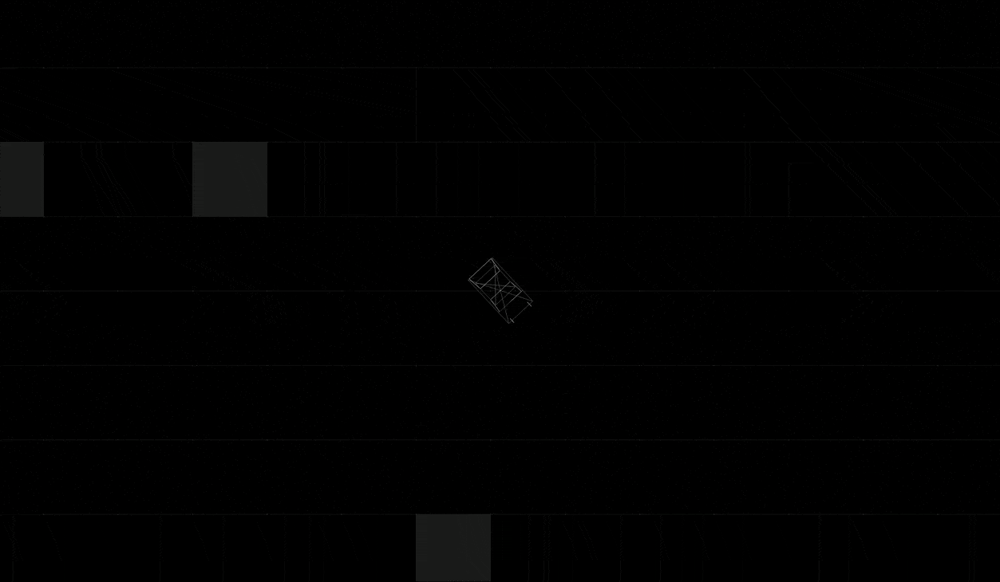

# VOID: A Minimalist Combat Racing Game in Three.js

When I set out to create VOID, I wanted to build a game that combined the sleek aesthetics of wireframe graphics with intense combat racing mechanics. The result is a monochromatic battle arena where players navigate through a dangerous grid while fighting AI opponents.



[Try it on CodePen](https://codepen.io/OmPreetham/pen/xbxrRMB) | [View Source](https://github.com/OmPreetham/void)

## The Vision

VOID draws inspiration from classic wireframe games while adding modern gameplay elements:
- Clean, minimalist graphics using only black, white, and shades of gray
- Physics-based car combat with 50 AI opponents
- Dynamic health system reflected in car colors
- Hazardous terrain that adds strategic depth

## Core Features

### Visual Design
The game's aesthetic is built around wireframe graphics and minimalist design:
```javascript
// Health-based color system example
this.healthColors = {
    100: 0xffffff, // Pure white - Full health
    70: 0xcccccc,  // Light gray - Moderate damage
    30: 0x555555,  // Dark gray - Heavy damage
    0: 0x222222    // Nearly black - Critical
};
```

### Combat System
Players engage in intense battles using:
- Laser weapons with visual trails
- Physics-based collisions
- Health-based damage system
- Visual feedback for hits

### Hazard Zones
The arena features dangerous gray zones that damage players:
```javascript
// Creating hazard zones
const hazardGeometry = new THREE.PlaneGeometry(cellSize, cellSize);
const hazardMaterial = new THREE.MeshBasicMaterial({
    color: 0x444444,
    transparent: true,
    opacity: 0.4
});
```

### Special Effects
Every action has visual feedback:
- Laser trails and impact effects
- Car destruction animations
- Spawn effects
- Dramatic restart sequences

## Technical Implementation

### Three.js for 3D Graphics
The game uses Three.js for rendering:
```javascript
// Scene setup
this.scene = new THREE.Scene();
this.scene.background = new THREE.Color(0x000000);

// Orthographic camera for clean 2D-style view
const aspect = window.innerWidth / window.innerHeight;
const frustumSize = 40;
this.camera = new THREE.OrthographicCamera(
    frustumSize * aspect / -2,
    frustumSize * aspect / 2,
    frustumSize / 2,
    frustumSize / -2,
    1,
    1000
);
```

### Physics System
Custom physics implementation for realistic movement:
```javascript
// Physics properties
this.velocity = new THREE.Vector3();
this.mass = isPlayer ? 2.0 : 1.0;
this.elasticity = 0.5;
```

### AI Behavior
The game features 50 AI opponents with independent behavior:
```javascript
// AI movement
if (!this.isPlayer) {
    this.aiChangeDirectionCounter++;
    if (this.aiChangeDirectionCounter > 100) {
        this.rotationSpeed = (Math.random() - 0.5) * this.maxRotationSpeed;
        this.aiChangeDirectionCounter = 0;
    }
}
```

## Development Challenges

### 1. Performance Optimization
Managing 50 AI cars with physics, lasers, and effects required careful optimization:
- Efficient collision detection
- Object pooling for lasers
- Optimized visual effects

### 2. Visual Clarity
Creating distinct visuals using only grayscale required careful consideration:
- Health-based color gradients
- Transparent effects for depth
- Clear visual feedback

### 3. Game Balance
Balancing the game elements took iteration:
- AI behavior and difficulty
- Weapon damage and cooldown
- Health system and damage rates
- Hazard zone placement and damage

## Controls

- Arrow Keys: Movement
- Space: Shoot lasers
- Space (when destroyed): Restart game

## Future Development

Planned features include:
1. Multiplayer support
2. Additional weapon types
3. Power-ups and upgrades
4. Different arena layouts
5. Custom game modes

## Try It Out

Experience VOID yourself:
1. Clone the repository
2. Start a local server
3. Open in your browser
4. Battle against 50 AI opponents in a minimalist arena

The game is open source and available on GitHub. Contributions and feedback are welcome!

## Conclusion

VOID demonstrates that compelling gameplay doesn't require complex graphics. By focusing on clean design, responsive controls, and engaging mechanics, we've created an intense combat racing experience that proves less can be more.

^_^
---